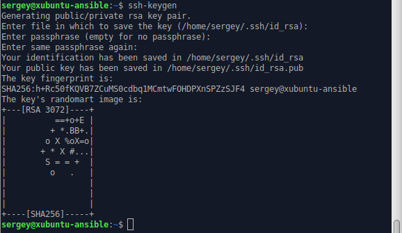
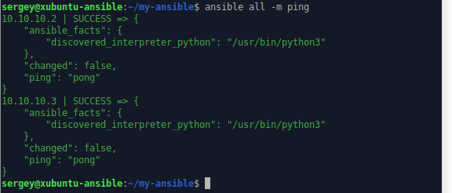

# Домашнее задание к занятию «Ansible. Часть 1»

---

### Задание 1

**Ответьте на вопрос в свободной форме.**

Какие преимущества даёт подход IAC?

### Решение

1. Автоматизированная настройка уменьшает количество человеских ошибок
2. Скорость — настройка («поднятие») инфраструктуры занимает заметно меньше времени
3. Воспроизводимость — поднимаемая инфраструктура всегда идентична
4. Масштабируемость — один инженер может с помощью одного и того же кода настраивать и управлять огромным количеством машин
5. Возможность использовать систему контроля версий для отслеживания любых изменений инфраструктуры
6. Возможность повторного использования скриптов конфигурирования для нескольких серверных сред, например, для разработки, тестирования и производства
7. Возможность предоставлять сотрудникам общий доступ к скриптам конфигурирования для упрощения сотрудничества в стандартизированной среде разработки
8. Упрощает процесс дублирования серверов для ускорения восстановления при сбое системы

---

### Задание 2 

**Выполните действия и приложите скриншоты действий.**

1. Установите Ansible.
2. Настройте управляемые виртуальные машины, не меньше двух.
3. Создайте файл inventory с созданными вами ВМ.
4. Проверьте доступность хостов с помощью модуля ping.

### Решение

1. Установил Ansible на xubuntu-ansible.

2. Настроил управляемые машины.
* установил ssh на xubuntu-1 и xubuntu-2

* сгенерировал ключ на xubuntu-ansible

* скопировал его на xubuntu-1 и xubuntu-2

3. Создал файл inventory.ini с созданными ВМ и конфигурационный файл ansible.cfg.

4. Проверил доступность хостов с помощью модуля ping.

---

### Задание 3 

**Ответьте на вопрос в свободной форме.**

Какая разница между параметрами forks и serial? 

### Решение

---

### Задание 4 

В этом задании вы будете работать с Ad-hoc коммандами.

**Выполните действия и приложите скриншоты запуска команд.**

1. Установите на управляемых хостах любой пакет, которого нет.
2. Проверьте статус любого, присутствующего на управляемой машине, сервиса. 
3. Создайте файл с содержимым «I like Linux» по пути /tmp/netology.txt.

### Решение

 
